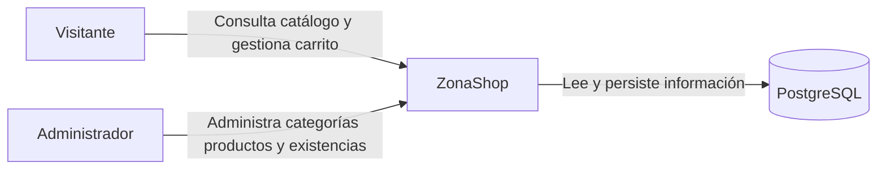
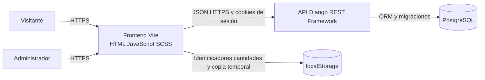
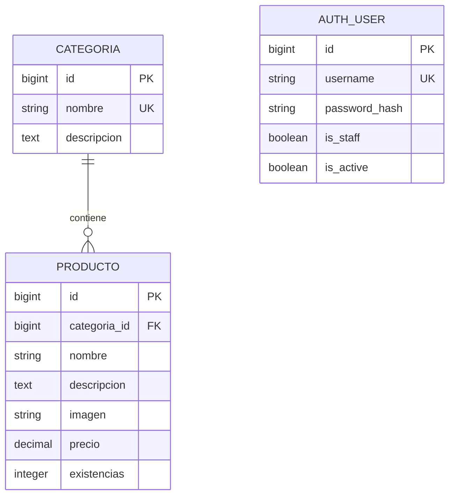

# Arquitectura de ZonaShop

## Alcance de la versión

ZonaShop separa la interfaz web y la API REST en dos proyectos independientes. La versión actual incluye catálogo, administración de categorías y productos, autenticación administrativa y carrito local.

No incluye pagos en línea, pedidos confirmados, facturación, envíos ni registro de clientes. Esas funciones requieren una decisión de alcance independiente.

## Contexto C4

## Contenedores C4

## Componentes

### Frontend

- `src/api/`: solicitudes HTTP, credenciales y token CSRF.
- `src/admin/`: formularios y listados administrativos.
- `src/auth/`: inicio, consulta y cierre de sesión.
- `src/carrito/`: cantidades, importes, persistencia y revalidación.
- `src/catalogo/`: presentación y detalle de productos.
- `src/styles/`: estilos SCSS y comportamiento adaptable.

### Backend

- `catalogo/`: categorías, productos, imágenes, existencias y permisos.
- `cuentas/`: autenticación administrativa basada en sesiones.
- `config/`: configuración por entorno, seguridad, OpenAPI y rutas.

El directorio `clientes/` permanece inactivo: no está registrado en `INSTALLED_APPS` ni expuesto mediante las rutas del proyecto.

## Modelo entidad relación

El carrito no tiene una tabla. El navegador conserva su selección y consulta nuevamente cada producto al restaurarla para actualizar precios y existencias.

## Flujo de seguridad

1. El frontend solicita `/api/auth/csrf/`.
2. Django establece la cookie CSRF y devuelve el token.
3. El frontend incluye `X-CSRFToken` en operaciones de escritura.
4. El login crea una sesión únicamente para usuarios activos con `is_staff=True`.
5. Las consultas del catálogo son públicas.
6. Las escrituras requieren sesión administrativa y un token CSRF válido.
7. En producción, las cookies, HTTPS, HSTS, hosts y orígenes se controlan mediante variables de entorno.

## Decisiones técnicas

| Decisión | Motivo |
| --- | --- |
| Frontend y backend separados | Mantener responsabilidades, dependencias y despliegues independientes. |
| Monolito modular Django | El alcance no requiere microservicios. |
| Sesiones y cookies | Aprovechar autenticación y protección CSRF nativas de Django. |
| PostgreSQL | Persistencia relacional y compatibilidad con el ORM. |
| Carrito en `localStorage` | El carrito no representa una compra confirmada ni reserva inventario. |
| Precios del carrito en centavos enteros | Evitar errores acumulados de coma flotante. |
| OpenAPI con drf-spectacular | Mantener un contrato verificable y Swagger UI. |
| Configuración por variables | Evitar secretos y direcciones específicas dentro del código. |
